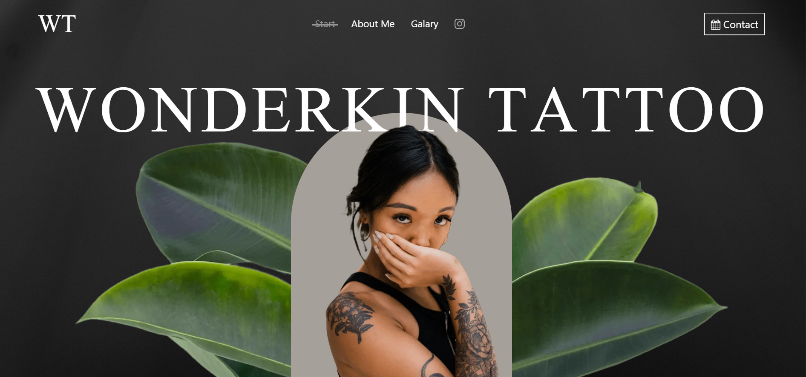

# Tattoo Animated Website.



# 🖋️ Tattoo Animated Website

> A modern, scroll-animated tattoo-themed portfolio site built with **Next.js 14**, **React 19**, **Tailwind CSS**, **GSAP**, and **Lenis** for buttery smooth animations.


---

## Demo

> Add your live link here:
**[ Live Preview](https://tattoo-animated-website.vercel.app/)**

---

## 🧠 Features

-  Seamless navigation using **Lenis smooth scrolling**
-  High-performance animations powered by **GSAP**
-  Responsive design with **Tailwind CSS**
-  Built with **React 19 concurrent features**
-  SSR and SEO-friendly with **Next.js**
-  Fully animated and responsive on mobile, tablet, and desktop

---

## Tech Stack

| Technology    | Description                     |
|---------------|---------------------------------|
| Next.js       | React framework for SSR/SSG     |
| React 19      | Concurrent React features       |
| Tailwind CSS  | Utility-first CSS framework     |
| GSAP          | JavaScript animation library    |
| Lenis         | Smooth scroll experience        |

---

## Getting Started

### 1. Clone the repo

```bash
git clone https://github.com/DigitalGenius-ui/tattoo-animated-website.git
cd tattoo-animated-website

